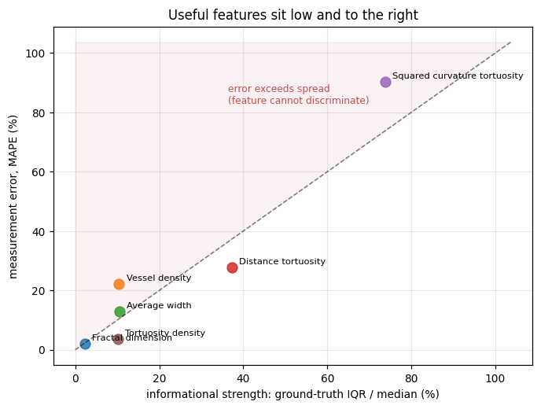
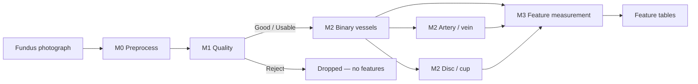
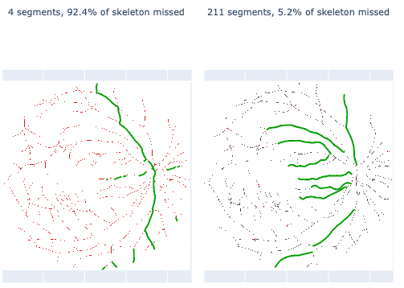
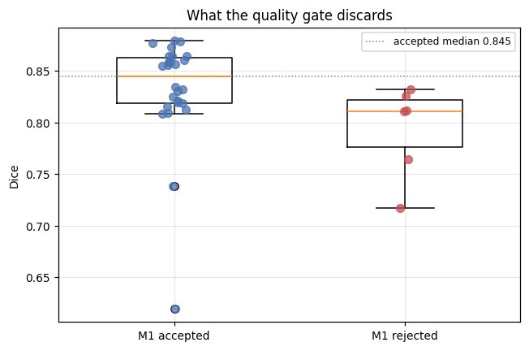
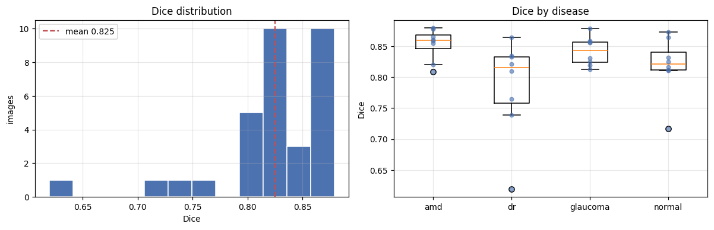
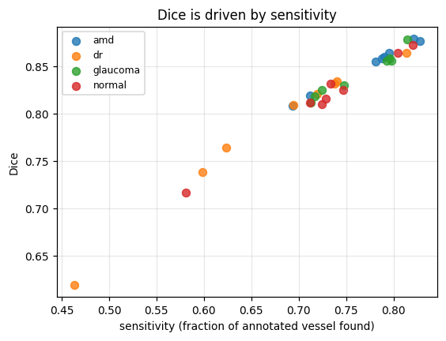
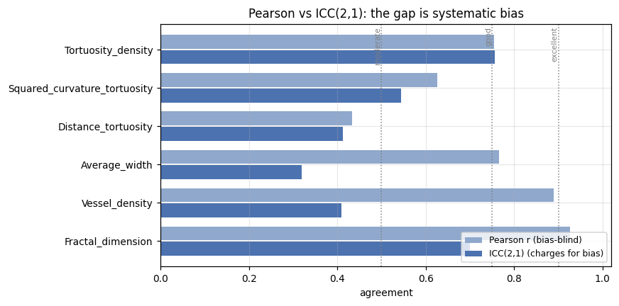
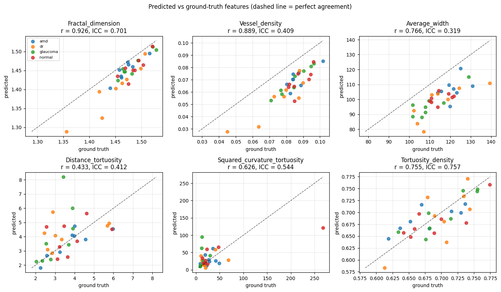
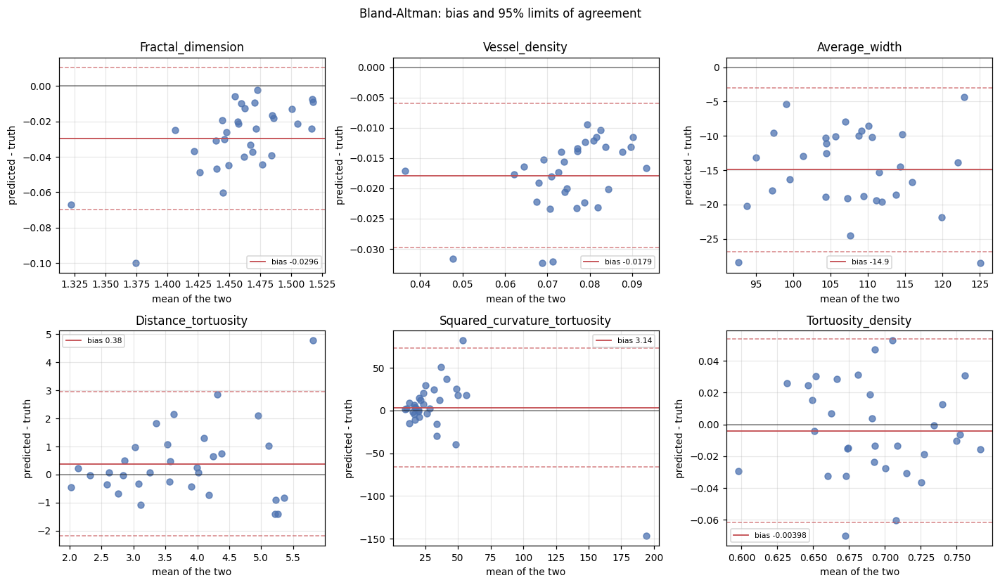
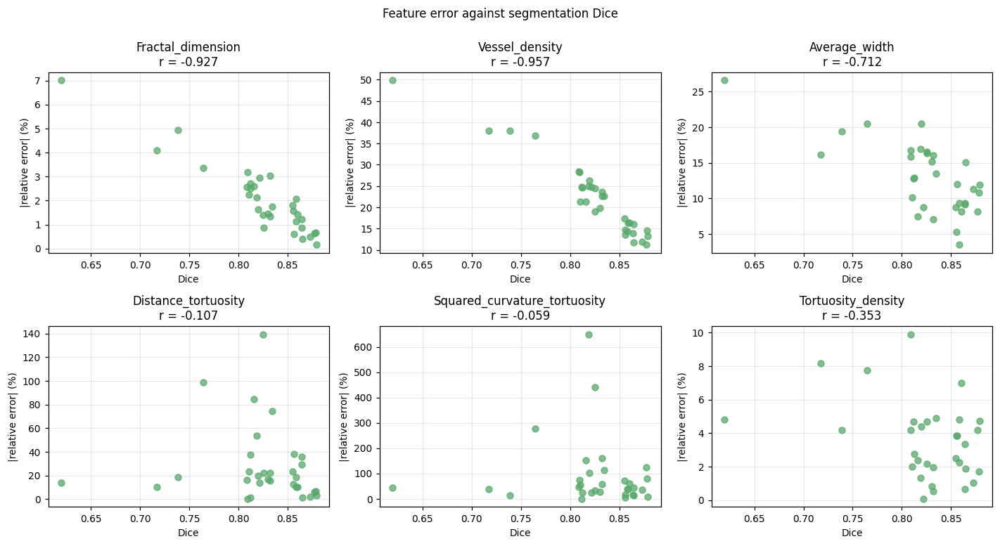

# AutoMorph FIVES Benchmark Report

Vessel segmentation and six whole-image morphological features on an independent high-quality subset of the FIVES dataset.

> Figures under [`images/`](images/) (exported from `benchmark/analysis_M2_vessels.ipynb` unless noted).

---

## Contents

1. [Quick summary](#1-quick-summary)
2. [AutoMorph](#2-automorph)
3. [Previous published benchmarks](#3-previous-published-benchmarks)
4. [FIVES dataset and image selection](#4-fives-dataset-and-image-selection)
5. [M1 quality assessment](#5-m1-quality-assessment)
6. [M2 vessel segmentation](#6-m2-vessel-segmentation)
7. [Morphological feature agreement](#7-morphological-feature-agreement)
8. [Conclusions](#8-conclusions)
9. [References](#9-references)

---

## 1. Quick summary

AutoMorph was benchmarked on **32** FIVES quality-3 test images (8 each AMD / DR / glaucoma / normal) that were **not** used in AutoMorph training. Two runs: full pipeline (M1 quality gate on) and vessel-only (gate bypassed, all 32 segmented). Vessel maps and six whole-image features were scored against FIVES expert annotations through the same morphometry path.

**M1 quality selection needs significant improvement.** It silently rejected **6 of 32** already high-quality photographs — five of them healthy eyes — before any segmentation ran. Rejects are only modestly harder (Dice 0.794 vs 0.832); discarding them gains **+0.007 Dice** for a **19%** cohort loss. Two cuts turned on millimetres of a hardcoded `softmax_bad` threshold. For small research cohorts the gate is too aggressive; it requires re-tuning or human review of rejects (§5). Clinical studies already report similar attrition (Giesser, Eid — §3).

**Segmentation under-segments; Dice tracks sensitivity.** On all 32 images: Dice **0.825**, sensitivity **0.736**, specificity **0.995**. About a quarter of annotated vessel is missed; almost nothing is invented. Dice correlates with sensitivity at **r = 0.987** (§6.2), so Dice is essentially a restatement of how much vessel was found. That is also the clearest improvement path: raising sensitivity (fewer missed vessels) would raise Dice almost one-for-one. DR is weakest (Dice 0.786), again on sensitivity.

**Of the six features, usefulness is uneven and inconsistent.** Only `Tortuosity_density` is reliable (ICC 0.76, low bias). `Vessel_density` and `Average_width` track truth but sit systematically low (−21% / −13%) — rank-usable after calibration, not absolute quotes. `Distance_tortuosity` and `Squared_curvature_tortuosity` fail as per-image measures. The plot below makes the inconsistency visible: features do not share one usable regime.



**Figure (from §7.4).** Informational strength (ground-truth IQR/median) vs measurement error (MAPE). Useful features would sit **low and to the right**. `Fractal_dimension` is measured accurately but barely varies — almost no population signal to discriminate eyes. `Squared_curvature_tortuosity` has the most spread but error exceeds it (cannot discriminate). The rest scatter between those extremes; there is no single “good enough” band that covers the feature set. The same pattern is already visible in the published literature (§3): Giesser’s retest volatility and formula shoot-out, Eid’s near-zero tortuosity ICC vs SIVA, and VascX’s modest gains from better segmentation all say that AutoMorph’s shipped morphometrics are not interchangeable in quality — especially the tortuosity family.

**Practical read.** Review or relax M1 rejects; treat binary vessel maps as the stronger product; prefer `Tortuosity_density` among the six whole-image outputs; do not use distance / squared-curvature tortuosity per image; do not assume Dice green-lights tortuosity. Full numbers and caveats in §§5–8.

**Future goal.** Audit the feature-extraction path (retipy morphometry, centreline tracing / `detect_vessel_border`, aggregation) for bugs and incorrect implementation. Impossible value ranges vs SIVA (Eid), retest collapse for tortuosity despite stable masks (Giesser), and modest gains when only segmentation is swapped (VascX) all point at the measurement layer, not only the network — see §3. This FIVES accuracy check is consistent with that diagnosis; a code-level review is the natural next step.

---


## 2. AutoMorph

### 2.1 Project

AutoMorph is an open-source deep learning pipeline for automated quantification of retinal vascular morphology from colour fundus photographs [1]. It was developed at UCL / Moorfields and published in *Translational Vision Science & Technology* (2022). The design goal is a fully automated chain from a raw photograph to clinically used morphometric features, without manual vessel correction — a common bottleneck in earlier tools such as IVAN, SIVA and VAMPIRE.

Since release it has become a de-facto feature-extraction mechanism for many research projects in oculomics and retinal imaging. OpenAlex records **137 citing works** for Zhou et al. (2022), with the count still climbing through 2025 — evidence of sustained uptake rather than a one-off methods citation.

The pipeline is modular. Each stage can be inspected or replaced; features are not predicted end-to-end from the photograph, but measured from segmented anatomy with classical formulas. That transparency is intentional: it keeps feature definitions comparable to the literature and to other software that uses the same formulas.

Project site: <https://rmaphoh.github.io/projects/automorph.html>  
Source: <https://github.com/rmaphoh/AutoMorph>

### 2.2 Pipeline (M0–M3)

The repository names four successive modules. This report focuses on binary vessel segmentation (M2) and the six whole-image features derived from it (M3); the other branches are summarised for context.



| Module | Role | Implementation used here |
| --- | --- | --- |
| **M0 — Preprocess** | Detect the circular retina, mask the background, crop to a square, record crop geometry and microns-per-pixel scale | Thresholding / morphological crop (EyeQ-style), writing `crop_info.csv` |
| **M1 — Quality** | Grade each image *good / usable / reject*; only gradable images proceed | EfficientNet-B4 ensemble (8 models) trained on EyePACS-Q, with confidence rectification |
| **M2 — Segmentation** | Binary vessel map; artery/vein; optic disc/cup | Binary vessels: adversarial BF-Net ensemble at 912². A/V and disc/cup are separate networks |
| **M3 — Features** | Morphometry on whole-image and zone windows | [retipy](https://github.com/alevalv/retipy) formulas applied to the M2 maps |

**M1 is a hard gate.** Images placed in `Bad_quality/` produce no segmentation and no feature row. That matters for any cohort study that trusts AutoMorph to decide which eyes enter the analysis.

**Resolution.** Width and calibre metrics need millimetres per pixel. AutoMorph reads `resolution_information.csv` (or a placeholder such as 0.008 mm/pixel for Topcon 3D-OCT). FIVES publishes no pixel size; how this benchmark handles that is noted in later chapters and does not affect the five dimensionless features.

### 2.3 The six whole-image morphological features

This report evaluates the six binary-vessel features AutoMorph reports for the whole macular-centred image. All six are computed by the bundled retipy code (`evaluate_window` / `global_cal`) from a binary vessel map and its skeleton. Definitions below follow the retipy implementations and the citations they carry.

| Feature | Meaning | Formula sketch |
| --- | --- | --- |
| **Fractal_dimension** | Complexity / space-filling of the vessel tree | Minkowski–Bouligand (box-counting) dimension of the binary vessel map [2] |
| **Vessel_density** | Fraction of the image occupied by vessel | (vessel pixels) / (all pixels) |
| **Average_width** | Mean vessel calibre | (vessel area) / (skeleton length) × resolution → microns when resolution is known |
| **Distance_tortuosity** | Arc–chord tortuosity | For each vessel segment: curve length / chord length; then average over vessels [3] |
| **Squared_curvature_tortuosity** | Integrated squared curvature along the centreline | \(\int \kappa^2\,ds\) from centred finite differences on the traced path [3] |
| **Tortuosity_density** | Tortuosity that accounts for inflection points | Grisan et al.: segments between inflection points, normalised by vessel length [4] |

**Clinical reading (brief).** Fractal dimension and vessel density summarise how much vasculature is present and how complex it is. Average width tracks calibre (narrowing / dilation). The three tortuosity measures quantify vessel “bendiness” with different sensitivities: distance tortuosity is a simple length ratio; squared-curvature tortuosity emphasises sharp local bends and is sensitive to centreline noise; tortuosity density was designed to grade tortuosity in a way that better matches clinical ranking.

Zone B / Zone C features and artery–vein calibre (CRAE, CRVE, AVR) are part of AutoMorph but are outside the scope of this report.

### 2.4 Origin in retipy — and what AutoMorph changed

Feature *measurement* in AutoMorph comes from **retipy** (Valdes et al.) [5]: classical morphometry on a binary vessel image and skeleton. AutoMorph embeds that code in `M3_feature_whole_pic` / `M3_feature_zone` and feeds it the pipeline’s own segmentations.


The morphometric *formulas* (tortuosity, fractal dimension, density, width) are shared. The binary vessel *detector* is not. 

#### Centreline extraction: `detect_vessel_border`

Before tortuosity is computed, the skeleton must be broken into individual vessel centrelines. That is `detect_vessel_border` in `retipy/retina.py`. AutoMorph keeps the original retipy extractor in a commented block and ships a modified version (dated 2021/10/31 in the source). The two algorithms behave very differently on the same skeleton.

**Original retipy** (commented as “original remove x duplicate”):

1. Flood-fill each connected component of the skeleton from a seed pixel.
2. Sort the collected pixels by row (`x`).
3. **Keep only one point per row** — any further pixels that share the same `x` are discarded.

There is no junction handling. A branched tree is often one connected component; after the one-point-per-row filter, most of that component is thrown away. What survives tends to be long, roughly vertical paths. Horizontal and diagonal branches are systematically under-represented. On a representative FIVES skeleton this recovered only **4 segments** and left **92.4% of skeleton pixels unused**.

**AutoMorph** (active code):

1. First pass: `intersection()` counts 8-neighbours at every skeleton pixel. If a pixel has **more than two** active neighbours it is treated as a **junction** and erased (a small disk is painted out of a mask, then applied to the skeleton). That cuts the tree into edge pieces between branch points.
2. Flood-fill each remaining connected piece.
3. **Do not** sort by row or drop duplicate `x` — every pixel of the piece is kept as the centreline.

Long vessels that pass through several bifurcations become several shorter segments. Coverage of the skeleton jumps: on the same example, **211 segments**, with only **5.2% of skeleton pixels missed**. Tortuosity is then averaged over those segments (see `evaluate_window`), so the measurement population is “inter-junction arcs” rather than “one thinned tree per connected component.”

```
Original retipy                          AutoMorph
─────────────────                        ─────────────────
skeleton (connected tree)                skeleton
        │                                       │
        │                                erase junctions (>2 neighbours)
        │                                       │
 flood-fill whole component              flood-fill each edge piece
        │                                       │
 sort by row; keep 1 point / row         keep all pixels of the piece
        │                                       │
 few long (mostly vertical) paths        many shorter inter-junction segments
```



**Figure.** `detect_vessel_border` on the same vessel skeleton. **Left — original retipy:** 4 segments; 92.4% of the skeleton missed. The one-point-per-row rule preserves a few long paths and drops most of the tree. **Right — AutoMorph:** junctions removed first; 211 segments in total (only the **10 longest** are drawn in green for readability); 5.2% of the skeleton missed. Long vessels are split into many arcs at branch points.

That change matters for the three tortuosity features, which are defined on traced centrelines and then averaged across segments. Fractal dimension, vessel density and average width are computed from the vessel map / skeleton *globally* (`global_cal`) and do not depend on `detect_vessel_border`. When this report later compares predicted and ground-truth tortuosity, both sides use AutoMorph’s junction-splitting extractor — so they share the same centreline convention; they are not being compared to upstream retipy’s one-point-per-row behaviour.

---

## 3. Previous published benchmarks

PubMed indexes only ~18 papers with “AutoMorph” in title/abstract, while the tool is cited hundreds of times in methods sections. The literature below is the subset that **published benchmark numbers**, not every downstream user. Across those papers, **tortuosity is repeatedly the weak point** — even when segmentation looks acceptable.

### 3.1 Zhou et al. 2022 — original validation vs expert maps

Binary vessel segmentation (trained on CHASE_DB1, DRIVE, STARE, HRF, IOSTAR, LES-AV) [1]:

| External set | F1 | Sensitivity | Specificity |
| --- | --- | --- | --- |
| DR HAGIS | 0.78 | 0.84 | 0.98 |
| AV-WIDE | 0.73 | 0.71 | 0.98 |

Also: artery/vein F1 **0.66** (IOSTAR-AV); disc F1 **0.94** (IDRiD).

Feature agreement vs expert annotation on DR HAGIS — whole-image ICC [1, Table 3]:

| Feature | Whole-image ICC (95% CI) |
| --- | --- |
| Fractal dimension | 0.94 (0.88–0.97) |
| Vessel density | 0.94 (0.88–0.97) |
| Average width | 0.97 (0.95–0.99) |
| Distance tortuosity | 0.86 (0.73–0.93) |
| Squared curvature tortuosity | 0.84 (0.68–0.92) |
| Tortuosity density | 0.87 (0.74–0.93) |

Density / width / fractal dimension sit at ICC > 0.9. Tortuosity is reported as “good consistency,” but Zone B Bland–Altman limits of agreement tell a harsher story for individual use [1]:

| Feature (Zone B) | Mean difference | 95% LoA |
| --- | --- | --- |
| Distance tortuosity | +0.02 | **−2.18 to +2.22** |
| Squared curvature tortuosity | −1.02 | **−14.59 to +12.56** |
| Tortuosity density | +0.02 | −0.09 to +0.13 |

For metrics whose physiological range is narrow, LoA of ±2.2 (distance) or ±13 (squared curvature) are effectively uninformative at the individual level — even in the paper that introduced the pipeline.

### 3.2 Inter-software context — morphometry is not interchangeable

McGrory et al. compared **SIVA** and **VAMPIRE** on *n* = 665 Lothian Birth Cohort images [8]:

| Parameter class | ICC |
| --- | --- |
| Vessel width (CRAE / CRVE) | 0.16–0.28 |
| Tortuosity (artery / vein) | **0.25–0.28** |
| Fractal dimension / AVR | 0.37–0.41 |
| **All reported parameters** | **0.16–0.41** |

Poor cross-tool tortuosity ICC is a field-level problem, not unique to AutoMorph.

### 3.3 Giesser et al. 2024 — test–retest (most damning for tortuosity)

Clinical retest on a Zeiss VISUCAM Pro NM; **76** AutoMorph metrics per image [9]:

| Cohort | Subjects | Design | Taken → after M1 gate |
| --- | --- | --- | --- |
| Intervisit | *n* = 28 | 1–14 days apart | 112 → **70** (−37.5%) |
| Intravisit | *n* = 44 | same session, 5 min | 176 → **148** (−15.9%) |

**Segmentation maps are stable:** accuracy ≥ 97%; mean F1 **0.82** / **0.85**; Jaccard **0.70** / **0.74** (inter / intra).

**Metrics are not:**

| | Intervisit | Intravisit |
| --- | --- | --- |
| Spearman | 0.34–0.99 | 0.55–0.96 |
| ICC | 0.31–0.99 | 0.40–0.97 |
| Mean abs. % difference | 0.96%–**223.7%** | 0.49%–**371.2%** |

**Worst four (Spearman)** — tortuosity dominates both cohorts:

- *Intervisit:* artery FD, vein tortuosity density Zone C, average vessel width, **tortuosity density**
- *Intravisit:* vein squared-curvature tortuosity, vein tortuosity density, vein tortuosity density Zone B, **artery tortuosity density**

Example LoA: artery tortuosity density **−0.085 to +0.085** around mean ~0; vein squared curvature **−33 to +38**. Zone reliability ordered Zone C > Zone B > whole macula (intervisit *P* = 0.007 / 0.035). Image quality (CNR + FD) explains only part of retest error (**R² = 0.53**). Authors’ summary: tortuosity and fractal dimension are **highly volatile** despite usable segmentation overlap.

### 3.4 Giesser et al. 2024 — tortuosity formula shoot-out (VCI)

Same intravisit *n* = 44, but recomputing **different tortuosity definitions** on AutoMorph masks [10]. Test–retest Spearman (arteries / veins / all vessels):

| Metric | Arteries | Veins | All vessels |
| --- | --- | --- | --- |
| Arc-over-chord | 0.46 | 0.50 | **0.48** |
| Angle tortuosity | 0.80 | 0.49 | 0.62 |
| Tortuosity density | **0.55** | 0.56 | 0.80 |
| Squared curvature | 0.67 | 0.57 | 0.78 |
| Distance tortuosity | 0.73 | 0.66 | 0.73 |
| Inverse-radius | 0.80 | 0.86 | 0.82 |
| **VCI** (proposed) | **0.92** | **0.86** | **0.87** |

VCI beat every listed metric (*P* < 0.05) except inverse-radius (*P* = 0.14). Cross-metric correlation is wild: distance vs squared-curvature Pearson **0.81**, but arc-over-chord vs inverse-radius **0.042**, VCI vs angle **0.05**. These “tortuosity” labels are largely measuring different things — formula choice alone can move Spearman from ~0.48 to ~0.87 on *identical* AutoMorph masks.

### 3.5 Eid et al. 2025 — AutoMorph vs SIVA (Montrachet)

*n* = 1,069 disc-centred photos, age 80 ± 3.9 years [11]. AutoMorph quality gate rejected **51.2%** (522 retained). ICC vs SIVA:

| Feature class | ICC |
| --- | --- |
| Fractal dimension | 0.77 (all) / 0.53 (vein) / 0.47 (artery) |
| Calibre (CRAE/CRVE/AVR) | **0.21–0.36** |
| **Distance tortuosity** | **0.0022** (artery) / **0.0008** (vein) / **0.0018** (all) |

Tortuosity agreement is effectively **zero**; >40% of differences fell outside the precision band. Scale data is the tell for Zone C artery distance tortuosity: AutoMorph **3.76 ± 3.22**, SIVA **1.10 ± 0.02**. An arc-over-chord ratio must be ≥ 1 and typically sits near 1.0–1.3. AutoMorph returning a mean of ~3.8 is not a simple rescaling issue — it points to segment fragmentation and/or aggregation that is not normalised like SIVA’s simple tortuosity (see also §2.4 on junction splitting).

### 3.6 Vargas Quiros et al. 2025 — VascX (segmentation swap, features held fixed)

Cleanest experiment: same feature-extraction code, only the segmentation model changed; 215 Rotterdam images vs grader ground truth [12]. Tortuosity ground-truth mean **1.09** (a sane arc/chord value — confirming the Eid scale problem is AutoMorph’s formula/aggregation, not the concept). MAE / Pearson (VascX vs AutoMorph):

| Feature | VascX | AutoMorph |
| --- | --- | --- |
| Tortuosity [median], artery | 0.0058 / **0.81** | 0.0060 / 0.73 |
| Tortuosity [median], vein | 0.0048 / **0.71** | 0.0053 / **0.57** |
| Tortuosity [length-weighted], artery | 0.017 / 0.52 | 0.019 / **0.47** |
| Curvature [median], artery | 1.07 / 0.93 | 1.27 / 0.90 |
| Inflection count [median], artery | 0.48 / 0.39 | 0.61 / **0.26** |

AutoMorph vessel Dice on public sets was roughly **0.74–0.82**; A/V and disc varied more widely. Improving A/V segmentation (VascX) helps tortuosity only modestly (vein median Pearson 0.57 → 0.71) — segmentation is not the whole bottleneck.

### 3.7 Engelmann et al. 2024 — fractal dimension noise (DART vs AutoMorph)

Repeatability of FD on the Caledonia multi-capture set [13]: AutoMorph ICC **0.578** vs DART **0.815**; within-eye / between-eye noise ratio λ **12.65%** vs **3.55%**. Same pattern as Giesser: AutoMorph’s *derived* features are noisier than its masks imply.

### 3.8 What this triangulates to

Three separable failure modes:

1. **Segmentation** is decent but not the main bottleneck for tortuosity (retest F1 0.82–0.85; VascX improves A/V yet only lifts vein tortuosity Pearson ~0.57 → ~0.71).
2. **The tortuosity implementation / aggregation** is the main problem (Eid near-zero ICC with SIVA plus impossible value ranges; §2.4 junction splitting is a candidate mechanism).
3. **The definitions themselves** are non-interchangeable (VCI paper: Spearman 0.48 → 0.87 on identical masks by changing the formula).

Downstream studies nevertheless keep publishing associations on AutoMorph tortuosity (e.g. CVD hazard ratios, age correlations) — sometimes with opposite age directions across cohorts, consistent with zone- and formula-dependent artifacts rather than settled biology [14–16]. Practical reading in that literature: treat AutoMorph binary / A–V masks as the useful output; recompute tortuosity carefully; inverse-radius is the best-performing non-proprietary option in Giesser’s shoot-out (Spearman 0.80–0.86); do not pool tortuosity with SIVA/VAMPIRE as if interchangeable.

### 3.9 Why another benchmark (this report)

1. **FIVES was never used** in AutoMorph training or in Zhou’s external validation (see §4).
2. Published feature ICCs are conditioned on images that *reach* measurement; quality-gate attrition is large in clinical sets (Giesser 16–38%, Eid **51%**) — this report scores the gate on known FIVES quality-3 images.
3. Prior work shows **poor retest and near-zero cross-tool ICC for tortuosity** without a controlled accuracy-vs-truth check on an independent annotated set. This report measures the six whole-image features on AutoMorph maps *and* on FIVES expert maps (same formulas, same AutoMorph centreline path) and links error to Dice / sensitivity.

---

## 4. FIVES dataset and image selection

### 4.1 FIVES

**FIVES** (*Fundus Image Dataset for Artificial Intelligence based Vessel Segmentation*) [6] comprises **800** colour fundus photographs at **2048×2048**, each with a pixel-level vessel annotation produced under a standardised multi-grader protocol. Composition:

- **200** images each: AMD, diabetic retinopathy (DR), glaucoma, normal;
- recommended **train / test** split of 600 / 200;
- per-image quality labels on three binary criteria (illumination/colour, blur, contrast), which this benchmark sums to a **quality score 0–3**.

Licence: CC BY 4.0. Archive: figshare [7].

### 4.2 Independence from AutoMorph training

FIVES is **not** among the training or external-validation sets listed for AutoMorph’s vessel, quality, artery/vein or disc models [1, Table 1]. It was published in 2022 as a dedicated vessel-segmentation resource. Using FIVES therefore tests AutoMorph on data the released models have not been tuned against — an out-of-distribution check relative to the original paper’s DR HAGIS / AV-WIDE vessel evaluation.

### 4.3 Selection of the benchmark subset

The runnable benchmark (`benchmark/selection.py`) draws a **fixed** subset under three constraints:

| Constraint | Value | Rationale |
| --- | --- | --- |
| Quality score | **exactly 3** | All three FIVES quality criteria pass — failures should indict the pipeline, not an unreadable photograph |
| Per disease | **8** (AMD, DR, glaucoma, normal) | Balanced groups so per-disease metrics stay comparable |
| Split | FIVES **test** only | Held-out split; every disease can supply ≥8 images at quality 3 |

Selection is **deterministic**: candidates are sorted by key and the first 8 of each disease are taken. There is no random seed. The recorded list is written to `benchmark/results/selection.csv` (and the vessel-only run’s copy under `benchmark/results/M2_vessels/`).

**Total: 32 images** (8 × 4 diseases).

Quality-3 images available in the FIVES `test` split (every group clears 8):

| Disease | Available at quality 3 | Used |
| --- | --- | --- |
| AMD | 42 | 8 |
| DR | 36 | 8 |
| Glaucoma | 22 | 8 |
| Normal | 33 | 8 |

Glaucoma is the scarcest high-quality group in the test split; it is also the disease with the most low-quality images in FIVES overall.

Three FIVES keys are permanently excluded as unscorable (`train_447_G`, `train_448_G` blank annotations; `train_174_D` carries another image’s mask). All are in the train split, so they do not affect this test-only selection; the guard exists so reconfigured runs cannot pick them.

### 4.4 Two complementary runs

| Run | Stages | Quality gate | Role in this report |
| --- | --- | --- | --- |
| **Full pipeline** | M0–M3 (all stages) | Enforced | What a user actually gets — including M1 rejections (§5) |
| **Vessel-only** (`run_vessel`) | M0 + M2 binary vessels | Bypassed — all 32 segmented | Fair Dice / feature comparison on every selected image (§6–§7) |

Native-resolution originals are fed to AutoMorph so that M0 derives crop and scale from the photograph itself.

---

## 5. M1 quality assessment

**Source:** full-pipeline run (`benchmark.run`) — M1 gate enforced. Gate grading uses the vessel-only run, which segments the same 32 images with the gate bypassed.

### 5.1 Completion — six FIVES quality-3 images rejected

Every selected image is FIVES quality **3**. M0 preprocesses all 32; M1 then drops six before any segmentation or features are produced:

| Stage | Images | of 32 |
| --- | --- | --- |
| Staged / M0 | 32 | 32 |
| **M1 good quality** | **26** | 32 |
| M1 bad quality | 6 | 32 |
| M2 binary vessel → M3 macular features | 26 | 32 |

Rejection is silent and total: no vessel map, no feature row. That matches the clinical attrition pattern in §3 (Giesser 16–38%, Eid 51%) — here on photographs already labelled highest quality by FIVES.

### 5.2 Rejections concentrate in healthy eyes

| Disease | Selected | Segmented | Rejected |
| --- | --- | --- | --- |
| AMD | 8 | 8 | 0 |
| DR | 8 | 7 | 1 |
| Glaucoma | 8 | 8 | 0 |
| **Normal** | 8 | **3** | **5** |

Five of eight healthy eyes are discarded; every AMD and glaucoma image passes. M1 is the EyePACS-Q ensemble (trained for DR screening). A domain effect on “clean healthy” fundus photographs is the obvious hypothesis; *n* = 8 per group is too small to prove it.

### 5.3 Two rejections turn on a hardcoded threshold

The merge step passes `Prediction == 0`, passes `Prediction == 1` only when `softmax_bad < 0.25`, and always fails `Prediction == 2`:

| key | disease | Prediction | softmax_bad | outcome |
| --- | --- | --- | --- | --- |
| test_56_D | dr | 1 | 0.258 | rejected by **0.008** |
| test_151_N | normal | 1 | 0.282 | rejected by **0.032** |
| test_167_N | normal | 1 | 0.427 | rejected |
| test_158_N | normal | 2 | 0.544 | rejected outright |
| test_161_N | normal | 2 | 0.575 | rejected outright |
| test_162_N | normal | 2 | 0.635 | rejected outright |

### 5.4 Was the gate worth it? (answered by the vessel-only run)

Segmenting the six rejects shows the gate is directionally right but a poor trade:

| | *n* | Dice | sd | Sensitivity |
| --- | --- | --- | --- | --- |
| M1 **rejected** | 6 | **0.794** | 0.044 | 0.687 |
| M1 accepted | 26 | **0.832** | 0.053 | 0.747 |

Mann–Whitney *p* = 0.025 (rejects are genuinely harder). Discarding them raises mean Dice from **0.825 → 0.832** — **+0.007 for 19% of the cohort**.

Per reject (worst first):

| key | disease | Dice | Sensitivity |
| --- | --- | --- | --- |
| test_167_N | normal | 0.717 | 0.581 |
| test_56_D | dr | 0.764 | 0.624 |
| test_158_N | normal | 0.811 | 0.724 |
| test_151_N | normal | 0.812 | 0.711 |
| test_162_N | normal | 0.826 | 0.747 |
| test_161_N | normal | 0.832 | 0.733 |

Only two are clearly weak. Four sit at or above the accepted median; `test_161_N` matches the accepted mean. Two of those four were cut by millimetres on the `softmax_bad` threshold.



**Figure.** Dice for images M1 accepted vs rejected (vessel-only run). Rejects are lower on average, but the distributions overlap heavily.

**Reading.** For small research cohorts, silent dropping of FIVES quality-3 (especially healthy) eyes is costly. Prefer reviewing rejects or relaxing the usable-quality cutoff rather than trusting the gate as an absolute filter.

---

## 6. M2 vessel segmentation

**Source:** vessel-only run (`benchmark.run_vessel`) — all **32** images, quality gate bypassed. Scores are Dice / IoU / sensitivity / specificity inside the FOV on the 912 grid against FIVES expert annotations.

### 6.1 Overall and by disease

| Disease | Dice | IoU | Sensitivity | Specificity | *n* |
| --- | --- | --- | --- | --- | --- |
| AMD | 0.853 | 0.744 | 0.776 | 0.995 | 8 |
| Glaucoma | 0.842 | 0.728 | 0.763 | 0.994 | 8 |
| Normal | 0.819 | 0.696 | 0.731 | 0.994 | 8 |
| **DR** | **0.786** | **0.653** | **0.674** | 0.997 | 8 |
| **All** | **0.825** | **0.705** | **0.736** | **0.995** | 32 |



**Figure.** Left: Dice histogram over all 32 images. Right: Dice by disease (AMD / glaucoma highest; DR lowest).

### 6.2 Under-segmentation, not over-segmentation

Sensitivity **0.736** vs specificity **0.995**: about a quarter of annotated vessel is missed; almost nothing is invented. Dice correlates with sensitivity at **r = 0.987** (with specificity −0.59) — on this cohort Dice is essentially a restatement of sensitivity.



**Figure.** Dice vs sensitivity, coloured by disease. The tight diagonal shows that segmentation error is missed vessel, not false vessel. DR points sit lower on both axes.

**DR** is the weakest disease specifically on sensitivity (0.674). Haemorrhages / exudates obscuring vessels is a plausible reading, consistent with false negatives rather than false positives.

**Normal Dice in the full run (0.851 on 3 survivors) was an artefact of the gate.** On all eight healthy eyes it is **0.819**. Any per-disease figure from a gated run inherits the gate’s bias against healthy eyes (§5).

Specificity and accuracy sit near 1 for any prediction here (vessels ≈ 2% of the FOV) and should not be used to compare methods.

**Caveat.** Ground truth is downsampled with `nearest` to the 912 grid (matching the current scorer). Switching to `area` would raise Dice by roughly +0.03; see `benchmark/docs/protocol.md`. Dice here is not comparable to a native-resolution FIVES leaderboard number.

---

## 7. Morphological feature agreement

**Source:** vessel-only run — predicted features from AutoMorph vessel maps vs the same six features measured on FIVES expert annotations through the **identical** AutoMorph/retipy path (`measure_masks`). *n* = 32. Headline statistic: ICC(2,1) (absolute agreement; charges for systematic bias). Pearson is reported for contrast.

### 7.1 Agreement table (all 32)

| Feature | rel. bias % | MAPE % | Pearson | Spearman | **ICC(2,1)** | ICC 95% CI | Reading |
| --- | --- | --- | --- | --- | --- | --- | --- |
| Tortuosity_density | −0.6 | 3.6 | 0.755 | 0.711 | **0.757** | 0.55–0.87 | good |
| Fractal_dimension | −2.0 | 2.0 | 0.926 | 0.869 | **0.701** | 0.49–0.81 | moderate |
| Squared_curvature_tortuosity | +10.2 | 90.2 | 0.626 | 0.278 | 0.544* | −0.05–0.65 | see leverage |
| Distance_tortuosity | +10.6 | 27.6 | 0.433 | 0.576 | **0.412** | 0.17–0.69 | poor |
| Vessel_density | −21.4 | 22.1 | 0.889 | 0.792 | **0.409** | 0.18–0.57 | poor |
| Average_width | −12.9 | 12.9 | 0.766 | 0.832 | **0.319** | 0.21–0.41 | poor |

\* Headline ICC for squared curvature is a leverage artefact (§7.3); robust ICC = **0.144**.

Compared with the gated full run (*n* = 26), every stable ICC is **lower by ~0.03–0.10** — survivor bias is real. Feature *ordering* is unchanged.



**Figure.** Pearson (association, blind to bias) vs ICC(2,1) (absolute agreement). Large gaps for `Vessel_density` and `Average_width` are the systematic under-segmentation offsets (−21% and −13%).

### 7.2 Predicted vs truth and Bland–Altman



**Figure.** Predicted vs ground-truth for each feature (dashed = identity). `Tortuosity_density` and `Fractal_dimension` track the diagonal; density and width sit systematically low; distance / squared-curvature tortuosity scatter widely.



**Figure.** Bland–Altman (predicted − truth). `Vessel_density` limits exclude zero entirely (systematic under-call). Squared-curvature LoA are huge relative to the cohort scale.

### 7.3 Leverage — one image can manufacture an ICC

Leave-one-out ICC (flag if one image moves ICC by > 0.15):

| Feature | ICC (all 32) | Most influential | ICC without it | Fragile? |
| --- | --- | --- | --- | --- |
| Squared_curvature_tortuosity | 0.544 | **test_158_N** | **0.144** | **yes** |
| Others | — | — | swings ≤ 0.13 | no |

`test_158_N` (an M1 reject) has GT squared curvature **267.8** vs cohort median **19.9**. Spearman stays at 0.278. **Verdict: unusable** — judge on the robust ICC, not the headline.

### 7.4 Informational strength — accuracy ≠ usefulness

Ground-truth spread over all 32 annotated images (`IQR / median`):

| Feature | IQR/median | spread/noise | ICC (robust) | Verdict |
| --- | --- | --- | --- | --- |
| Tortuosity_density | 0.101 | **2.37** | 0.757 | **reliable** |
| Average_width | 0.105 | 1.97 | 0.319 | rank-usable, biased — calibrate |
| Fractal_dimension | 0.023 | 1.65 | 0.701 | usable with care — very narrow spread |
| Vessel_density | 0.104 | 1.45 | 0.409 | rank-usable, biased — calibrate |
| Distance_tortuosity | 0.373 | **0.96** | 0.412 | error ≥ population spread |
| Squared_curvature_tortuosity | 0.738 | **0.41** | 0.144 | **unusable** |


**Figure.** Relative population spread (IQR/median) vs MAPE. Useful features sit low and to the right. `Fractal_dimension` is measured accurately but barely varies; the two remaining tortuosity measures carry spread the pipeline cannot resolve.

This inverts the Zhou 2022 picture somewhat: the features AutoMorph reproduces best (`Fractal_dimension`) have the least to say on this cohort; the tortuosity measures with most spread are the ones that fail.

### 7.5 Is Dice a usable proxy for feature trust?

In production there are no annotations. Correlation of Dice with absolute relative feature error:

| Feature | corr(Dice, \|rel err\|) | median \|rel err\| % |
| --- | --- | --- |
| Vessel_density | **−0.96** | 21.3 |
| Fractal_dimension | **−0.93** | 1.7 |
| Average_width | **−0.71** | 12.4 |
| Tortuosity_density | −0.35 | 3.6 |
| Distance_tortuosity | −0.11 | 17.7 |
| Squared_curvature_tortuosity | −0.06 | 43.3 |



**Figure.** Absolute relative feature error vs Dice. Density / fractal / width errors fall as Dice rises; tortuosity errors do not.

So Dice can green-light density and size features; it says almost nothing about tortuosity — consistent with Giesser (§3): segmentation can be stable while tortuosity is not.

### 7.6 Summary for the six features (M2_vessels, *n* = 32)

| Feature | Use? |
| --- | --- |
| **Tortuosity_density** | Yes — only feature clearing both ICC and spread/noise |
| Fractal_dimension | Usable with care — accurate but IQR only 2.3% of median |
| Vessel_density | Rank / stratify only — calibrate the −21% bias before quoting absolutes |
| Average_width | Rank / stratify only — same, −13% bias (microns are nominal on FIVES) |
| Distance_tortuosity | Do not use to rank eyes — noise ≈ spread |
| Squared_curvature_tortuosity | Do not use — no agreement with truth once leverage is removed |

These are the numbers to prefer over the gated full-run feature table: same pipeline, no survivor bias from M1.

---

## 8. Conclusions

This benchmark ran AutoMorph on 32 FIVES quality-3 test images that the released models never saw in training, scored binary vessel maps against expert annotations, and compared the six whole-image features to the same formulas applied to those annotations. Two runs answer different questions: the full pipeline shows what a user actually gets (M1 gate on); the vessel-only run scores every image (gate off). Prefer the vessel-only numbers for segmentation and feature agreement.

1. **The quality gate is the largest single source of data loss, and it is too aggressive for small cohorts.** It silently rejected 6 of 32 FIVES quality-3 photographs — five of them healthy eyes — before any segmentation ran. Rejects do segment worse on average (Dice 0.794 vs 0.832, *p* = 0.025), but discarding them buys only **+0.007 Dice** for a fifth of the cohort; four of six rejects land at or above the accepted median. This echoes the clinical attrition in Giesser and Eid (§3). For research cohorts, review rejects or raise the usable-quality cutoff rather than trusting the gate as absolute.

2. **Vessel segmentation under-segments consistently; that is a model property, not a survivor artefact.** On all 32 images: Dice **0.825**, sensitivity **0.736**, specificity **0.995**. About a quarter of annotated vessel is missed and almost nothing is invented; Dice is essentially a restatement of sensitivity (*r* = 0.987). DR is weakest (Dice 0.786), specifically on sensitivity. The full run’s “normal” Dice of 0.851 on three survivors was an artefact of the gate; on all eight healthy eyes it is **0.819**.

3. **Under-segmentation propagates into density and width — do not cite those as independent corroboration.** `Vessel_density` sits **−21%** and `Average_width` **−13%** below truth. Pearson looks strong (0.89 and 0.77); ICC(2,1) rates them poor (0.41 and 0.32) because ICC charges for the offset. Use them to rank or stratify after calibration, not as absolute micron or density quotes. Absolute width microns on FIVES remain nominal (no published pixel size).

4. **Of the six features, only `Tortuosity_density` clears both agreement and informativeness.** ICC 0.76, negligible bias, spread/noise 2.4. `Fractal_dimension` is accurately reproduced (MAPE 2%, ICC 0.70) but barely varies on this cohort (IQR/median 2.3%) — a precise measurement of a narrow signal. `Distance_tortuosity` cannot rank eyes (noise ≈ spread). `Squared_curvature_tortuosity` is unusable once a single leverage image is removed (robust ICC 0.14). Accuracy and informativeness are anti-correlated across the set: the features measured best are not always the ones worth measuring.

5. **These accuracy results align with the published negative tortuosity literature, but from a different angle.** Giesser showed AutoMorph tortuosity fails *retest* despite stable masks; Eid showed near-zero ICC vs SIVA and impossible value ranges; VascX showed swapping segmentation only modestly helps. Here the check is agreement with an independent expert map on FIVES. Distance and squared-curvature tortuosity fail that check; tortuosity density does not — so the three “tortuosity” outputs are not interchangeable (§2.4, §3.4). Downstream studies that pick one variant and report hazard ratios should treat the choice as load-bearing.

6. **Dice is not a blanket quality signal for reported features.** It predicts relative error for `Vessel_density`, `Fractal_dimension` and `Average_width` (*r* ≈ −0.71 to −0.96) and is uninformative for distance and squared-curvature tortuosity (*r* ≈ −0.06 to −0.11). In production, where no annotation exists, a good Dice does not green-light the tortuosity numbers in the CSV.

7. **Judge absolute agreement with ICC, not Pearson alone.** The Pearson–ICC gap *is* the bias. Reporting Pearson for density and width would materially overstate usability — the same lesson as Zhou’s high ICCs on a gated expert comparison versus Giesser’s retest and this report’s absolute-agreement numbers.

**Practical recommendations.** (i) Do not silently drop M1 rejects on small cohorts. (ii) Prefer vessel-only / ungated evaluation when scoring segmentation or features. (iii) Trust `Tortuosity_density` among the six whole-image outputs; treat density and width as rank features needing calibration; do not use distance or squared-curvature tortuosity per image. (iv) If tortuosity is the scientific target, consider recomputing from the mask with a retest-stable definition (inverse-radius or VCI per Giesser) rather than shipping AutoMorph’s defaults unchanged. (v) Do not pool AutoMorph tortuosity with SIVA/VAMPIRE as if interchangeable.

**Limits.** *n* = 32 (8 per disease); one cohort; one camera family after M0; scored at 912 not native resolution; artery/vein, disc/cup and zone features were not the focus of the vessel-only run. Findings are strong enough to set priorities and reading rules for AutoMorph users, not to replace a multi-site methods paper.

---

## 9. References


1. Zhou Y, Wagner SK, Chia MA, et al. AutoMorph: Automated retinal vascular morphology quantification via a deep learning pipeline. *Transl Vis Sci Technol.* 2022;11(7):12. <https://doi.org/10.1167/tvst.11.7.12>
2. Mandelbrot BB. *The Fractal Geometry of Nature.* W. H. Freeman; 1982. (Minkowski–Bouligand / box-counting dimension as used in retipy.)
3. Hart WE, Goldbaum M, Côté B, Kube P, Nelson MR. Measurement and classification of retinal vascular tortuosity. *Int J Med Inform.* 1999;53(2–3):239–252.
4. Grisan E, Foracchia M, Ruggeri A. A novel method for the automatic grading of retinal vessel tortuosity. *Proc IEEE EMBS.* 2003:866–869. <https://doi.org/10.1109/IEMBS.2003.1279902>
5. Valdes A, et al. retipy — Retinal Image Processing on Python. <https://github.com/alevalv/retipy>
6. Jin K, Huang X, Zhou J, et al. FIVES: A Fundus Image Dataset for Artificial Intelligence based Vessel Segmentation. *Sci Data.* 2022;9:475. <https://doi.org/10.1038/s41597-022-01564-3>
7. Jin K, et al. FIVES: A Fundus Image Dataset for AI-based Vessel Segmentation. figshare. <https://doi.org/10.6084/m9.figshare.19688169>
8. McGrory S, Taylor AM, Pellegrini E, et al. Towards standardization of quantitative retinal vascular parameters: comparison of SIVA and VAMPIRE measurements in the Lothian Birth Cohort 1936. *Transl Vis Sci Technol.* 2018;7(2):12. <https://doi.org/10.1167/tvst.7.2.12>
9. Giesser SD, Turgut F, Saad A, et al. Evaluating the impact of retinal vessel segmentation metrics on retest reliability in a clinical setting: a comparative analysis using AutoMorph. *Invest Ophthalmol Vis Sci.* 2024;65(13):24. <https://doi.org/10.1167/iovs.65.13.24>
10. Giesser SD, Turgut F, Saad A, et al. A new retest-stable tortuosity metric for retinal vessel analyses. *Invest Ophthalmol Vis Sci.* 2024;65(12):30. <https://doi.org/10.1167/iovs.65.12.30>
11. Eid P, Bourredjem A, Anwer A, et al. Retinal microvascular biomarker assessment with automated algorithm and semiautomated software in the Montrachet dataset. *Transl Vis Sci Technol.* 2025;14(3):13. <https://doi.org/10.1167/tvst.14.3.13>
12. Vargas Quiros J, Liefers B, van Garderen KA, Vermeulen JP, Klaver CCW. VascX Models: deep ensembles for retinal vascular analysis from color fundus images. *Transl Vis Sci Technol.* 2025;14(7):19. <https://doi.org/10.1167/tvst.14.7.19>
13. Engelmann J, Moukaddem D, Gago L, Strang N, Bernabeu MO. Applicability of oculomics for individual risk prediction: repeatability and robustness of retinal fractal dimension using DART and AutoMorph. *Invest Ophthalmol Vis Sci.* 2024;65(6):10. <https://doi.org/10.1167/iovs.65.6.10>
14. Wang et al. Association study using AutoMorph tortuosity density and CVD risk in depression. *J Affect Disord.* 2026. <https://doi.org/10.1016/j.jad.2026.122349>
15. Talmor-Barkan Y, et al. RetiMap: retinal microvascular features in the Human Phenotype Project (AutoMorph). *JACC Basic Transl Sci.* 2026. <https://doi.org/10.1016/j.jacbts.2026.101596>
16. Injety R, et al. Ethnicity-stratified normative retinal vascular features from the UK Biobank using deep learning (AutoMorph). *Ophthalmol Sci.* 2026. <https://doi.org/10.1016/j.xops.2026.101221>

*Additional references (EyePACS-Q, DR HAGIS, AV-WIDE, BF-Net, etc.) to be expanded as result chapters cite them.*
