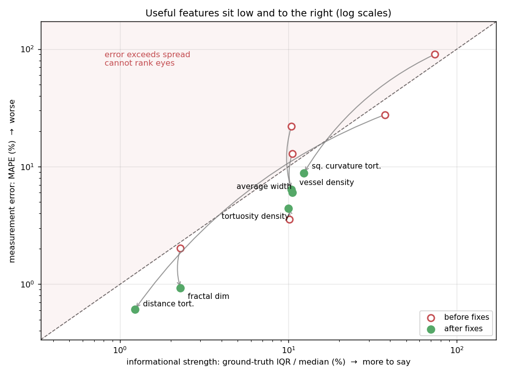
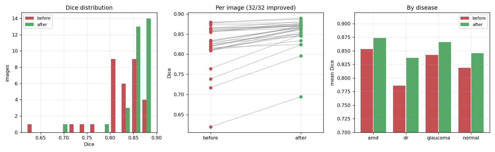
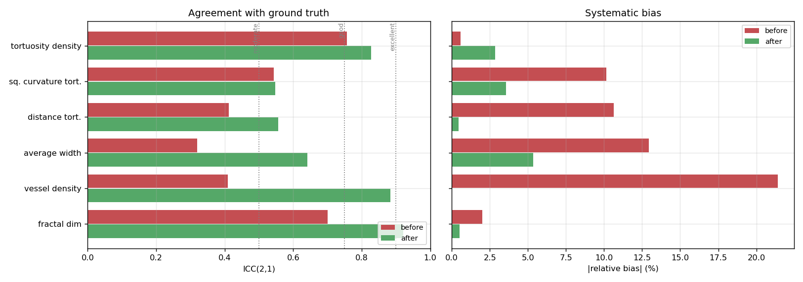
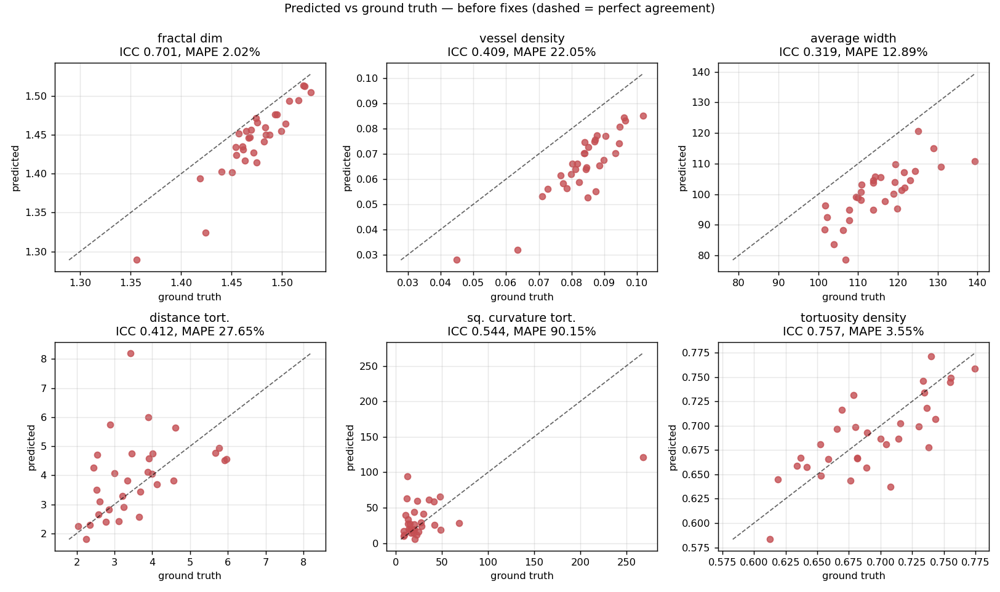
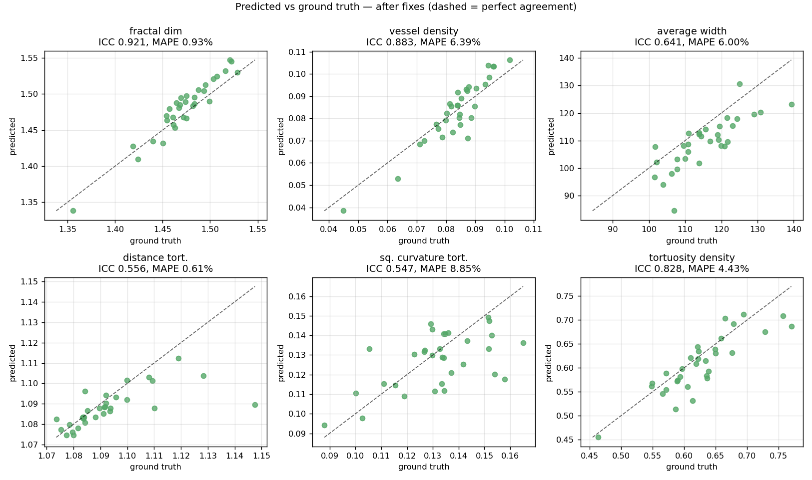
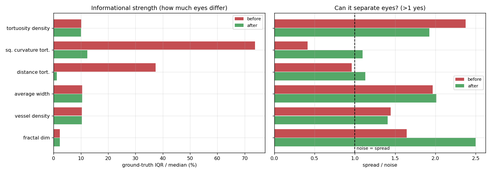
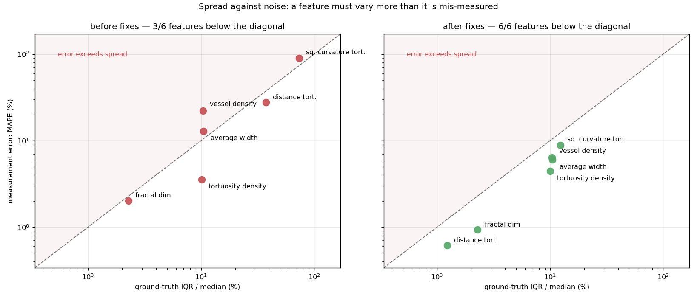

# AutoMorph post-fix report

Three defects in AutoMorph's vessel segmentation and measurement, found by benchmarking against the
FIVES expert annotations, and what fixing them changed.

Both runs below segment **all 32 benchmark images** with the M1 quality gate bypassed, so the
comparison is not confounded by the gate's selection. Everything here is generated from the recorded
run output by `benchmark/build_report.py`.

| | Before | After |
| --- | --- | --- |
| Results | `benchmark/results/M2_vessels/` | `benchmark/results/M2_vessels_thr02_mean/` |
| Vessel tracing | flood-fill discovery order | traced paths |
| Tortuosity minimum length | 15 px | 50 px |
| Binarisation threshold | 0.5 | 0.2 |
| Notebook | `analysis_M2_vessels.ipynb` | `analysis_M2_vessels_thr02.ipynb` |

---

## 1. Summary

Segmentation improved on **every one of the 32 images**, by **+0.030 Dice** on average (0.825 → 0.855) and
**+0.116 sensitivity** (0.736 → 0.852).
That matters less than what happened to the features AutoMorph actually reports.

The figure below is the whole result in one plot. The x axis is **informational strength** — how much
a feature varies between eyes, which bounds how much it could ever tell you. The y axis is
**measurement error**. Above the diagonal, a feature is measured worse than the population varies, so
it cannot rank eyes however good its other statistics look. Arrows run from before to after.



**Before, 3 of 6 features sat where measurement error was smaller than the spread they
had to resolve. After, 6 of 6 do.** Two features moved from the unusable region into the
usable one, and every feature moved left-and-down or stayed put.

The single largest change is `Vessel_density`, whose systematic bias went from
**-21.4%** to **-0.0%**. That bias had been reported as a property of
the pipeline; it was a thresholding artefact.

| Feature | ICC | reading | spread/noise | verdict |
| --- | --- | --- | --- | --- |
| Fractal_dimension | 0.921 | excellent | 2.500 | reliable |
| Vessel_density | 0.883 | good | 1.408 | usable with care |
| Average_width | 0.641 | moderate | 2.011 | usable with care |
| Distance_tortuosity | 0.556 | moderate | 1.129 | reliable |
| Squared_curvature_tortuosity | 0.547 | moderate | 1.098 | usable with care |
| Tortuosity_density | 0.828 | good | 1.927 | reliable |

No feature is now unusable. Before the fixes one was degenerate, two were biased enough to need
calibration before any absolute value could be quoted, and one had no detectable relationship with
the truth.

---

## 2. The fixes

### 2a. A bug in `detect_vessel_border`

`detect_vessel_border` returned each vessel's pixels in **flood-fill discovery order**, not in path
order along the vessel. `vessel_extractor` walked the segment with a **queue** (`pop(0)`, so
breadth-first) and appended each pixel as it was found. Seeded in the middle of a segment, a
breadth-first fill expands in *both* directions at once, so the returned sequence jumps back and
forth across the seed. A sort by x position that partly masked this was commented out in 2021.

This matters because every tortuosity measure treats consecutive points as consecutive *positions*
along the vessel:

| Function | What it assumes |
| --- | --- |
| `_curve_length` | sums the distance between successive points → arc length |
| `_chord_length` | takes the first and last point |
| `squared_curvature_tortuosity` | differentiates with `np.gradient` |
| `tortuosity_density` | splits the curve at inflections found *by index* |

None of them is meaningful on a sequence that teleports. Measured on the benchmark's own data before
the fix:

| | |
| --- | --- |
| Consecutive pairs that were **not** adjacent | **6.2%** |
| Mean size of those jumps | **42 px** |
| Largest jump | **145 px** on a 912 grid |

A 145-pixel step where a one-pixel move belongs inflates arc length severalfold. The evidence is in
the values: ground-truth distance tortuosity — an arc-to-chord ratio, so 1.0 means a straight vessel
— came out at a median of **3.38**. That would mean the
average retinal vessel wanders more than three times its end-to-end distance. It does not.

```python
# before — flood fill, pixels appended in *discovery* order
def vessel_extractor(window, start_x, start_y):
    vessel = []
    pending_pixels = [[start_x, start_y]]
    while pending_pixels:
        pixel = pending_pixels.pop(0)              # a QUEUE: breadth-first
        if window.np_image[pixel[0], pixel[1]] > 0:
            vessel.append(pixel)                   # order = when it was found
            window.np_image[pixel[0], pixel[1]] = 0
            pending_pixels.extend(neighbours(pixel, window))

    # sort by x position
    '''
    vessel.sort(key=lambda item: item[0])           # <- disabled 2021/10/31
    ...
    '''
    filtered_vessel = vessel
    return [[p[0] for p in filtered_vessel], [p[1] for p in filtered_vessel]]
```

The fix separates the two concerns. The flood fill still decides *which* pixels belong to the
segment; a walk decides *in what order* they are reported. `order_as_path` starts at an endpoint — a
pixel with exactly one neighbour in the set — and steps to the nearest unvisited neighbour, so every
consecutive pair is adjacent, at most √2 apart.

A set containing a branch point cannot be a single path. The walk is tried from each endpoint and the
longest simple path returned, which follows the trunk and drops the short spur — better than a
sequence that teleports between branches. Intersections are normally removed upstream, so branches
are rare.

```python
# after — the fill finds WHICH pixels; a walk decides IN WHAT ORDER
def vessel_extractor(window, start_x, start_y):
    segment = []
    pending_pixels = [[start_x, start_y]]
    while pending_pixels:
        pixel = pending_pixels.pop(0)
        if window.np_image[pixel[0], pixel[1]] > 0:
            segment.append((pixel[0], pixel[1]))
            window.np_image[pixel[0], pixel[1]] = 0
            pending_pixels.extend(neighbours(pixel, window))

    path = order_as_path(segment)                  # <- the fix
    return [[p[0] for p in path], [p[1] for p in path]]


def order_as_path(pixels):
    """Walk a connected pixel set neighbour to neighbour, starting from an endpoint."""
    positions = {tuple(p) for p in pixels}
    if len(positions) < 2:
        return sorted(positions)

    adjacency = {p: [n for n in _eight_neighbours(p) if n in positions] for p in positions}

    def walk(start):
        path, visited = [start], {start}
        while True:
            candidates = [n for n in adjacency[path[-1]] if n not in visited]
            if not candidates:
                return path
            # nearest first (4-connected before diagonal), then lexicographic for determinism
            step = min(candidates,
                       key=lambda n: ((n[0] - path[-1][0]) ** 2 + (n[1] - path[-1][1]) ** 2, n))
            path.append(step)
            visited.add(step)

    endpoints = sorted(p for p in positions if len(adjacency[p]) == 1)
    starts = endpoints or [min(positions)]          # a closed loop has no endpoint
    return max((walk(start) for start in starts), key=len)
```

After the fix, non-adjacent steps are **0.00%**, the largest step is exactly √2, and a straight
vessel scores exactly 1.0. Ground-truth distance tortuosity becomes
**1.090** — where a retinal arc-chord ratio belongs.

The fix is applied to both copies of retipy in the repository, so `retina.py` stays byte-identical
between `M3_feature_zone` and `M3_feature_whole_pic`; a test enforces that.

### 2b. Tuning the vessel-probability cut and the tortuosity length

**Binarisation threshold: 0.5 → 0.2.** M2 averages ten ensemble sigmoids and calls a pixel vessel
above a threshold, hardcoded at 0.5. At 0.5 the benchmark measured sensitivity
0.736 against specificity 0.995 — missing about
a quarter of the annotated vessel while inventing almost nothing. That asymmetry is the signature of
a threshold set too high, not of a model that cannot see vessels.

M2 saves the averaged sigmoid map, so the threshold can be swept without re-running the network:
re-binarise, re-apply `remove_small_objects(30)`, re-score.

| Threshold | dice | iou | sensitivity | specificity |
| --- | --- | --- | --- | --- |
| 0.05 | 0.8131 | 0.6862 | 0.9465 | 0.9539 |
| 0.1 | 0.8376 | 0.7218 | 0.9028 | 0.9696 |
| 0.15 | 0.8536 | 0.7458 | 0.8773 | 0.9786 |
| 0.2 | 0.8554 | 0.7488 | 0.8530 | 0.9832 |
| 0.25 | 0.8544 | 0.7476 | 0.8318 | 0.9864 |
| 0.3 | 0.8512 | 0.7429 | 0.8108 | 0.9890 |
| 0.35 | 0.8460 | 0.7354 | 0.7916 | 0.9908 |
| 0.4 | 0.8406 | 0.7276 | 0.7741 | 0.9923 |
| 0.5 | 0.8249 | 0.7050 | 0.7360 | 0.9948 |
| 0.6 | 0.8047 | 0.6770 | 0.6971 | 0.9965 |
| 0.7 | 0.7776 | 0.6406 | 0.6524 | 0.9978 |

**0.20 is the Dice optimum** at 0.8554, and the maximum is broad — 0.15
to 0.25 all land within 0.002 — so the exact value is not delicate, while 0.5 sits well down the
slope. The sweep reproduces the 0.5 run's Dice exactly, which is the check that it follows the
pipeline's own path. Note it optimises Dice, which weights sensitivity and precision equally; that is
a choice, not a clinical requirement.

Configured by `AUTOMORPH_VESSEL_THRESHOLD`, now defaulting to 0.2, and applied at **both** places M2
binarises — the 912 grid that feeds the features, and the crop-resolution map.

**Tortuosity minimum vessel length: 15 px → 50 px.** Arc-chord ratio and curvature are unstable when
the chord spans only a few pixels: a one-pixel wobble moves the ratio a long way, and skeletonisation
noise dominates the derivative. Segments shorter than 50 px are counted but not measured. The
threshold is `evaluate_window`'s existing `min_pixels_per_vessel` parameter — a measurement policy, so
it belongs with the caller rather than baked into the library.

Aggregation across vessels remains the **mean**, as the original code had it.

---

## 3. Dice, before and after

| Metric | before | after | change |
| --- | --- | --- | --- |
| dice | 0.8249 | 0.8553 | 0.0305 |
| iou | 0.7050 | 0.7487 | 0.0436 |
| sensitivity | 0.7360 | 0.8521 | 0.1161 |
| specificity | 0.9948 | 0.9833 | -0.0115 |

Sensitivity gains 11.6 points for
1.1 of specificity. Because
vessels occupy only ~2% of the field of view, that trade is strongly favourable: Dice and IoU both
rise.

**Dice improved on 32 of 32 images** — the gain is not an average masking a
mixture, it is every image moving the same way. The worst image before the fixes
(0.620) is still the worst after (0.694), but
by a smaller margin.



| Disease | n | Dice before | Dice after | change |
| --- | --- | --- | --- | --- |
| amd | 8.0000 | 0.8530 | 0.8735 | 0.0205 |
| dr | 8.0000 | 0.7856 | 0.8367 | 0.0512 |
| glaucoma | 8.0000 | 0.8420 | 0.8657 | 0.0237 |
| normal | 8.0000 | 0.8188 | 0.8452 | 0.0264 |

Every disease improves. Specificity and accuracy are near 1 for any prediction on this data, because
of how rare vessel pixels are, so they carry little information either way.

---

## 4. Feature agreement

Predicted against ground truth, both measured by the same code over the same images. ICC(2,1) is the
headline: unlike Pearson it charges for systematic bias, so a prediction that tracks the truth but
sits offset from it scores lower.

| Feature | ICC before | ICC after | bias % before | bias % after | MAPE % before | MAPE % after | Spearman before | Spearman after |
| --- | --- | --- | --- | --- | --- | --- | --- | --- |
| Fractal_dimension | 0.701 | 0.921 | -2.007 | 0.532 | 2.024 | 0.929 | 0.869 | 0.924 |
| Vessel_density | 0.409 | 0.883 | -21.421 | -0.035 | 22.052 | 6.391 | 0.792 | 0.825 |
| Average_width | 0.319 | 0.641 | -12.943 | -5.338 | 12.886 | 6.004 | 0.832 | 0.853 |
| Distance_tortuosity | 0.412 | 0.556 | 10.643 | -0.456 | 27.647 | 0.614 | 0.576 | 0.864 |
| Squared_curvature_tortuosity | 0.544 | 0.547 | 10.163 | -3.559 | 90.155 | 8.849 | 0.278 | 0.459 |
| Tortuosity_density | 0.757 | 0.828 | -0.574 | -2.848 | 3.552 | 4.435 | 0.711 | 0.858 |



Which fix did what:

- **The threshold** drove the accuracy and bias gains. `Vessel_density`'s bias falls from
  -21.4% to -0.0% — the probability mass was there all along, sitting
  between 0.2 and 0.5 and being discarded. `Fractal_dimension` and `Average_width` improve for the
  same reason.
- **The tracing fix** drove the tortuosity gains. `Distance_tortuosity`'s per-image error falls from
  27.6% to
  0.61%, and
  `Squared_curvature_tortuosity`'s from 90.2%
  to 8.85%.

`Squared_curvature_tortuosity`'s ICC barely moves
(0.544 →
0.547), but the before figure rested on a
single 13× outlier — 0.144 on leave-one-out — so the honest reading is 0.144 → 
0.547.

### Feature values

What the numbers actually are, which is how the tracing bug is visible directly: before the fix the
tortuosity measures took values no retinal vessel can have.

**Before the fixes**

| Feature | GT mean | GT median | GT min | GT max | pred mean | pred median | pred min | pred max |
| --- | --- | --- | --- | --- | --- | --- | --- | --- |
| Fractal_dimension | 1.473 | 1.473 | 1.356 | 1.529 | 1.443 | 1.45 | 1.289 | 1.513 |
| Vessel_density | 0.08361 | 0.08452 | 0.04492 | 0.1018 | 0.0657 | 0.0662 | 0.02786 | 0.08507 |
| Average_width | 115.4 | 114.1 | 101.6 | 139.3 | 100.4 | 101.1 | 78.53 | 120.7 |
| Distance_tortuosity | 3.57 | 3.38 | 2.031 | 5.965 | 3.95 | 3.935 | 1.797 | 8.197 |
| Squared_curvature_tortuosity | 30.91 | 19.88 | 8.644 | 267.8 | 34.06 | 26.36 | 5.45 | 120.9 |
| Tortuosity_density | 0.6938 | 0.6891 | 0.6127 | 0.7743 | 0.6898 | 0.6865 | 0.5833 | 0.771 |

**After the fixes**

| Feature | GT mean | GT median | GT min | GT max | pred mean | pred median | pred min | pred max |
| --- | --- | --- | --- | --- | --- | --- | --- | --- |
| Fractal_dimension | 1.473 | 1.473 | 1.356 | 1.529 | 1.481 | 1.486 | 1.338 | 1.547 |
| Vessel_density | 0.08361 | 0.08452 | 0.04492 | 0.1018 | 0.08358 | 0.08543 | 0.03843 | 0.1064 |
| Average_width | 115.4 | 114.1 | 101.6 | 139.3 | 109.2 | 109.7 | 84.4 | 130.6 |
| Distance_tortuosity | 1.093 | 1.09 | 1.074 | 1.148 | 1.088 | 1.087 | 1.075 | 1.112 |
| Squared_curvature_tortuosity | 0.1318 | 0.1335 | 0.08798 | 0.165 | 0.1271 | 0.1301 | 0.09415 | 0.1491 |
| Tortuosity_density | 0.6253 | 0.6217 | 0.4635 | 0.7701 | 0.6075 | 0.6033 | 0.4545 | 0.7115 |

---

## 5. Predicted vs ground truth

One panel per feature, predicted on the vertical axis against ground truth on the horizontal, with
the dashed line marking perfect agreement. Points below the line are under-estimates.

**Before the fixes** — note `Vessel_density` and `Average_width` sitting well below the line, and the
tortuosity panels scattered with no relationship to the truth.



**After the fixes** — the density and width panels collapse onto the identity line, and the tortuosity
panels acquire a relationship.



---

## 6. Informational strength

Agreement is only half the question. A feature must also **vary between eyes**, or it cannot separate
them however precisely it is measured. Informational strength is `IQR / median` over the ground truth
— robust, unit-free, and a property of the cohort rather than of the pipeline.

`spread / noise` combines the two: ground-truth IQR divided by the standard deviation of the
prediction error, with systematic bias excluded, since a constant offset does not stop a feature
separating two eyes but random scatter does. **Below 1, the noise covers the whole interquartile
range.**

| Feature | IQR/median before | IQR/median after | spread/noise before | spread/noise after |
| --- | --- | --- | --- | --- |
| Fractal_dimension | 0.0228 | 0.0228 | 1.6454 | 2.4996 |
| Vessel_density | 0.1041 | 0.1041 | 1.4458 | 1.4076 |
| Average_width | 0.1051 | 0.1051 | 1.9662 | 2.0106 |
| Distance_tortuosity | 0.3734 | 0.0123 | 0.9625 | 1.1287 |
| Squared_curvature_tortuosity | 0.7379 | 0.1234 | 0.4138 | 1.0983 |
| Tortuosity_density | 0.1014 | 0.0999 | 2.3738 | 1.9270 |



The same thing as a scatter — the plot from the analysis notebook, one panel per run on shared log
axes. A feature has to sit **below the diagonal**: measured better than the population varies. Above
it, the error swamps the differences the feature is supposed to resolve. **Before: 3
of 6. After: 6 of 6.**

Note this is stricter than the `spread / noise` column above, which is why the two counts differ.
`spread / noise` divides by the *standard deviation* of the error, so a systematic offset costs it
nothing; the diagonal here compares against MAPE, which includes the offset. `Vessel_density` before
the fixes is the case that separates them: spread/noise
1.45 looks acceptable, but a
-21.4% bias puts it above the diagonal. Both readings
are useful — one asks whether the feature can *rank* eyes, the other whether its value can be
*quoted*.



The tortuosity measures' apparent strength before the fixes was largely an artefact: the arc-length
inflation varied from image to image, and that variation looked like between-eye signal. Correctly
measured, they vary less — but they vary *real*, and their noise falls by more than their spread
does, which is why `spread / noise` improves for both.

`Fractal_dimension` is the opposite case and worth noting: it is measured most accurately of the six
(0.93% error) but has the least to say
(2.3% spread). Precision about
something that barely varies is not the same as usefulness — which is exactly what the summary figure
is for.

---

## Caveats

- **n = 32**, one cohort, all FIVES quality 3. The threshold optimum is the optimum *here* and is not
  a calibration transferable to other data without checking.
- All three fixes are in play at once in this comparison, so it has no control group. The per-fix
  attribution above comes from having measured them separately during development.
- `Average_width` is in nominal microns: FIVES publishes no pixel size, so the benchmark writes a
  placeholder 0.008 mm/pixel. Both sides share that scaling, so every comparison statistic here is
  unaffected; only the absolute micron value is not physical.
- `order_as_path` drops the shorter branch of a branching segment. Intersections are normally removed
  upstream so this is rare, but it is a deliberate simplification.
- Only vessel segmentation was re-run. Artery/vein and disc/cup have their own thresholds, untouched,
  and the zone features inherit the improved tracing but were not re-scored.
